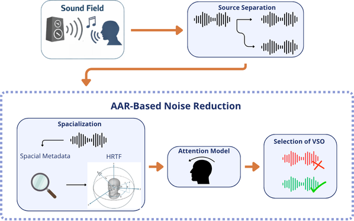
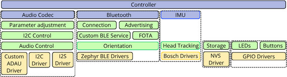
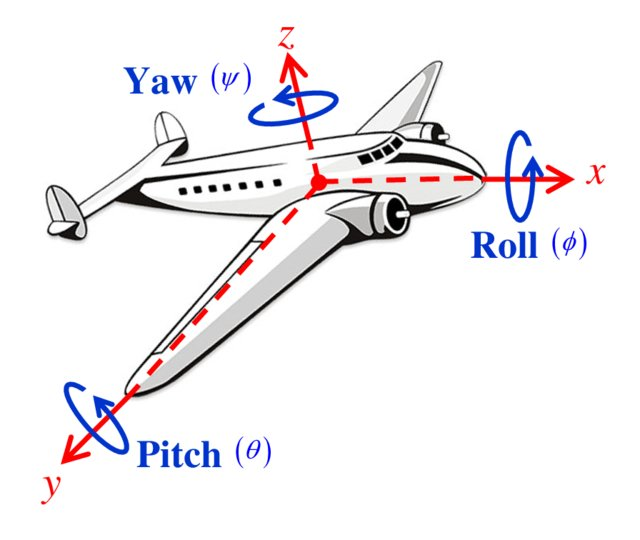

# Yaw Walk With Me  
### An IMU-Based Head Tracking Framework for Augmented Auditory Reality using Tiresias

<p align="center">
    
</p>

Yaw Walk With Me is a proof-of-concept framework for real-time head tracking applied to immersive audio and Augmented Auditory Reality (AAR).

The project combines:

- Bosch BMI270 IMU
- Nordic nRF5340 platform
- BLE quaternion streaming
- Python-based visualization
- Real-time orientation interaction
- 3D rendering

The implementation is built on top of the open-source hearing research platform [Tiresias](https://tiresias-web-gamma.vercel.app).

---

## Project Structure

```text
.
├── david-lynch.stl
├── figures
│   ├── board-size.webp
│   ├── euler.jpg
│   ├── fw.png
│   ├── objective.png
│   └── tiresias-icon-full.png
├── main.ipynb
├── main.py
├── README.md
└── venv
    ├── bin
    ├── etc
    ├── include
    ├── lib
    ├── pyvenv.cfg
    └── share
```

---

## Concept

The framework investigates how head orientation can be incorporated into immersive auditory environments for interaction with Virtual Sound Objects (VSOs).

The proposed architecture combines:

- embedded sensing
- quaternion orientation estimation
- low-latency BLE communication
- real-time 3D rendering
- head-referenced calibration
- angular interaction logic

<p align="center">
    
</p>

---

## Firmware Architecture

The embedded firmware was developed using Zephyr RTOS and the modular Tiresias firmware architecture.

The implementation includes:

- IMU subsystem
- orientation estimation
- BLE quaternion service
- BMI270 driver interface
- head tracking module

<p align="center">
    
</p>

Firmware repository:

- [Tiresias Firmware](https://github.com/felipepimentab/tiresias-fw)

---

## Orientation Estimation Pipeline

The system estimates orientation through sensor fusion:

```text
Accelerometer + Gyroscope
        ↓
   Sensor Fusion
        ↓
    Quaternion
        ↓
    Euler Angles
```

The yaw angle is employed as the main interaction variable.

<p align="center">
    
</p>

---

## BLE Communication

The embedded firmware periodically transmits quaternion orientation estimates through a custom BLE GATT service.

The Python application:

1. scans nearby BLE devices
2. identifies the Tiresias platform
3. subscribes to quaternion notifications
4. updates the visualization in real time

---

## Notebook Demonstration

The `main.ipynb` notebook was used as the presentation and experimental validation environment for the project.

It demonstrates:

- BLE device scanning
- quaternion streaming
- Euler conversion
- head calibration
- real-time rendering
- interaction logic validation

The notebook also serves as a reproducible proof-of-concept for the proposed AAR interaction model.

---

## Running the Project

Install dependencies:

```bash
pip install numpy bleak nest_asyncio asyncio ipympl pyqtgraph PyQt6 PyOpenGL numpy-stl qasync
```

Run the main application:

```bash
python main.py
```

Or open the interactive notebook:

```bash
jupyter notebook main.ipynb
```

---

## Current Features

- Real-time IMU head tracking
- BLE quaternion streaming
- Quaternion-to-Euler conversion
- Head-referenced calibration
- 3D visualization
- Orientation-driven interaction logic

---

## Future Work

Future developments include:

- dynamic binaural rendering
- HRTF-based spatial audio
- auditory attention estimation
- Virtual Sound Object selection
- adaptive source gain control
- multimodal interaction models

---

## References

- Grimm et al., 2018
- Mehra et al., 2020
- Tiresias Project